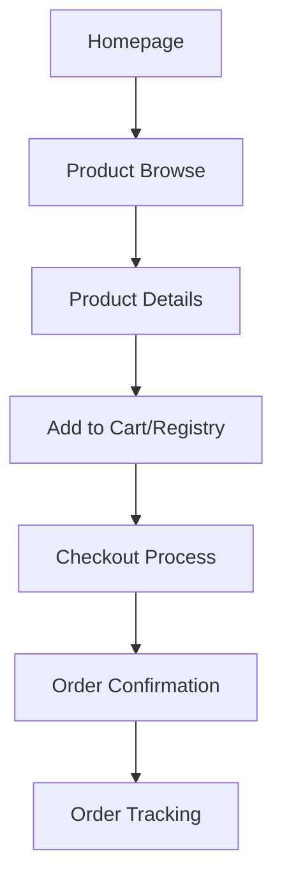
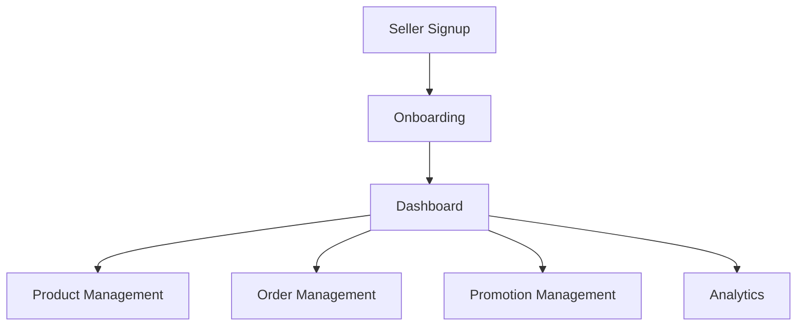

# VowSwap Platform Overview

## Core Architecture

VowSwap is a comprehensive wedding e-commerce platform built with Next.js, utilizing a modern tech stack:

- **Frontend**: Next.js with TypeScript
- **Database**: Prisma ORM with SQL database
- **Authentication**: NextAuth.js
- **Real-time Features**: WebSocket integration
- **Storage**: Supabase
- **Caching**: Redis
- **Push Notifications**: Firebase Cloud Messaging

## Key User Flows

### 1. Buyer Journey

### 2. Seller Journey

## Core Features

### 1. E-commerce
- Product catalog with advanced filtering
- Shopping cart management
- Secure checkout process
- Order tracking
- Bulk purchase requests
- Dynamic pricing and promotions

### 2. Wedding Registry
- Registry creation and management
- Gift tracking
- Multi-registry support
- Registry sharing capabilities

### 3. Seller Tools
- Product management
- Order processing
- Promotion creation (coupons, flash sales)
- Analytics dashboard
- Inventory management
- Storefront customization

### 4. User Features
- Authentication (sign up, sign in, email verification)
- Profile management
- Saved addresses
- Payment methods
- Order history
- Wishlists
- Chat support

### 5. Social Features
- Product reviews and ratings
- Review replies and moderation
- Helpful vote system
- Chat system between buyers and sellers

### 6. Wedding Services
- Service provider listings
- Service booking system
- Wedding trend analytics
- Theme customization

### 7. Loyalty Program
- Points system
- Referral tracking
- Rewards catalog
- Member benefits

### 8. Admin Tools
- Content moderation
- User management
- Analytics dashboard
- Report handling
- Platform statistics

## Technical Implementation

### 1. Database Schema
The platform uses a sophisticated database schema handling:
- User accounts and profiles
- Product catalog
- Order management
- Registry system
- Review system
- Chat/messaging
- Loyalty program
- Shipping/tracking

### 2. API Structure
RESTful API endpoints organized by feature:
- /api/products
- /api/orders
- /api/registry
- /api/reviews
- /api/seller
- /api/shipping
- /api/loyalty
- /api/admin

### 3. Mobile Optimization
- Responsive design
- Progressive Web App (PWA) support
- Mobile-specific components
- Touch-optimized interfaces

### 4. Performance Features
- Image optimization
- Caching strategies
- Code splitting
- SEO optimization
- Server-side rendering

### 5. Security Measures
- Authentication
- Authorization
- Data encryption
- Input validation
- Rate limiting
- CSRF protection

## Monitoring and Analytics

### 1. Business Metrics
- Sales analytics
- User engagement
- Conversion rates
- Revenue tracking
- Seller performance

### 2. Technical Metrics
- Performance monitoring
- Error tracking
- User behavior analytics
- System health metrics

## Integration Points

### 1. External Services
- Payment processors
- Shipping providers
- Email service
- Push notifications
- Cloud storage
- Analytics services

### 2. Third-party APIs
- Shipping tracking
- Payment gateways
- Social media integration
- Map services

## Future Scalability

The architecture is designed for scalability with:
- Microservices-ready structure
- Containerization support
- Cloud-native capabilities
- Modular component design
- Extensible API architecture
